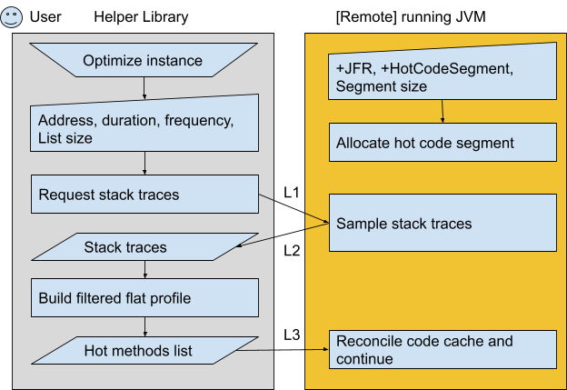
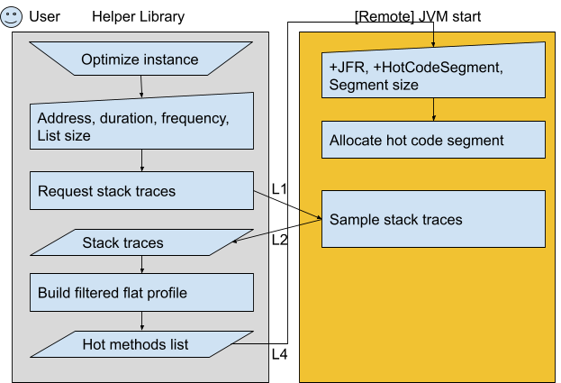
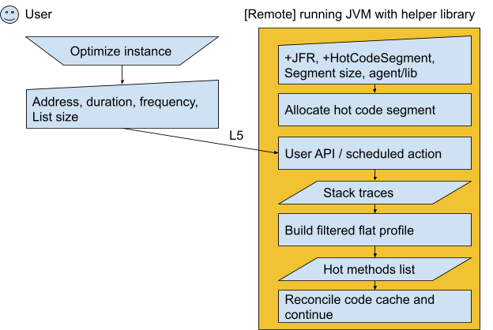
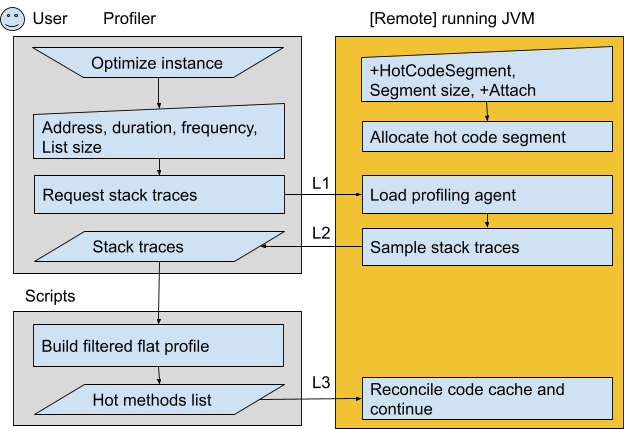
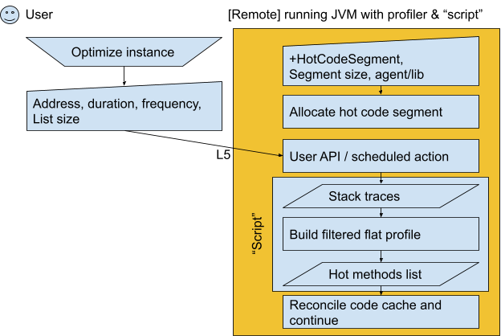
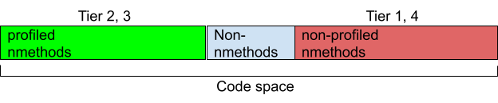
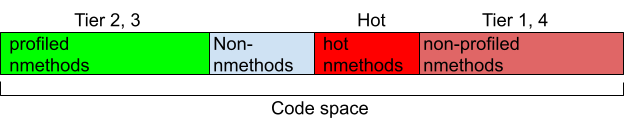

**BellSoft**

OpenJDK Team


# Automated compaction of hot nmethods


## **12<sup>th</sup> July 2023**


# OVERVIEW

This document describes a new solution that increases performance of HotSpot JVM for some applications; it is done for user (or “Java”) code, not for JVM code or runtime stubs. The solution is a combination of newly developed functionality in the OpenJDK and existing built-in and external tools. The engineering work on final pull requests and other public tooling will be based on this design and earlier prototypes that are referred here.

The HotSpot JVM watches method execution until some methods or their parts become very hot. Such  methods settle down in the code cache as methods compiled by C1 or C2 JIT compiler in a proper memory segment (code heap). It is too costly to keep full profiling of final method versions. The code cache fragmentation is a natural result of dynamic compilation during an application lifetime. Many applications with high CPU utilization in the steady state have huge code cache and “uniform” profile: there are many top methods taking just a little percent of the overall CPU. So the hot code is sparse. It is hard to measure fragmentation or sparseness for hot code only but in the case of a uniform profile it is close to the number for all compiled code. Different CPU microarchitectures benefit from compact hot code because of better instruction cache utilization and branch prediction. Experiments show hot code can lose 25% of performance when it’s sparse, and the proposed approach can improve such code by 15%. That happens for either small or large page configuration of the OS and JVM. Another issue is code cache thrashing. During their lifetime applications may use all available code cache. Some important compiled methods may be evicted because they are temporarily cold, and that affects performance on critical execution paths.

Automated compaction will include application profiling to determine a set of nmethods to compact and relocation of those nmethods to a smaller continuous part of memory. This part of memory should not be aggressively cleared.

The implementation is not supposed to be fully localized in the HotSpot. There is a related OpenJDK JEP draft [Instruction Issue Cache Hardware Accommodation](https://openjdk.org/jeps/8279184).

This document addresses the following questions:


1. How users will prepare applications, trigger improvements and what are expected results.
2. What the expected drawbacks for users are.
3. How hot code is expected to be stored and what is the possible configuration.
4. How the profiling is performed.
5. What data is collected and how it is exchanged.
6. What are expected environment constraints and how to address them.


# GOALS


1. Improve java code performance for applications with huge (hundred megabytes to gygabytes) code cache and uniform CPU profile on amd64 and aarch64.
2. Mitigate code cache thrashing.
3. Deliver improvements to already running and newly-started applications (solution can be enabled at JVM start up, as well as applied at runtime).
4. Provide one or few end-to-end methodologies, implement necessary APIs in OpenJDK, implement necessary external library code or scripts.
5. Minimize user effort and configuration.
6. Provide reasonable defaults.
7. The implementation should not depend on OS and CPU architecture.
8. The solution should be applicable to applications running in Linux containers.


# NON-GOALS


1. Improve JVM runtime code. Only user code performance is considered.
2. Improve small (less than 32 MB) code cache applications. Such applications are not impacted by the problem.
3. Build a zero-configuration autotuner. There are parameters to tune and user actions to take. However a system can be autonomous in some cases.
4. Introduce one more general purpose profiler. There are multiple existing profilers that can be used.


# CHANGES


1. A new OpenJDK mechanism to initiate and perform compaction of selected compiled code.
2. A new tool that helps to optimize applications performance by finding and compacting hot compiled code. It should work with and without application restarts.


# SUCCESS CRITERIA


1. With proposed changes, there should be throughput improvements in applications that suffer from code cache sparseness.
    1. Sparseness detection may be hardware specific but there are known metrics like CPU counters on certain hardware.
    2. Benchmarking can be done in a special mode when known industry benchmarks run in a sparse code cache mode.


# DESIGN OVERVIEW


## Summary


1. Optimization is triggered via API or CLI using a new Java library.
2. Use JFR as initial profiler.
3. Hot methods determined by profiling are moved to a new code cache segment.
4. Moving methods is a new functionality in the JVM. It is controlled via Compiler Control directives.


## General Considerations

There are important constraints that influence implementation and usage. Few possible quirks to mention:


* Network and remote access restrictions.
* JIT related flags, e.g. tiered/non-tiered JIT mode or segmented/non-segmented code cache.
* Virtualized guest OS or container.
* Non-root OS user.

A user determines some important additional parameters:


* JVM mode, e.g. turns on JFR and related options or a starting hot methods list, enables hot code segment support.
* Profiling settings.
    * The profiler and its options.
    * Profiling window (starting point, duration).
* Hotness thresholds. I.e. the number of top CPU-consuming methods to process.

Automated compaction is a recurring process. As an application load and state change, a user needs to actualize the optimization. It can be scheduled or automated but that’s out of scope for the current work. There is also a way to wipe out all optimization results by switching to a 0-methods profile.


## User Interaction


A. Remote user, built-in profiling.
    a. Online methods reconciliation.




    b. Offline.




B. Agent, built-in profiling.

    a. Online.




    In this use case it is possible to build an autonomous solution for legacy applications, the interference in their work and configuration is minimal:


* Helper library and management code are packed as a JVM agent.
* The only addition is to place the agent, then load the agent dynamically or via command line options. Note that there are preparations to disallow dynamic agent loading ([JEP 451](https://openjdk.org/jeps/451)).
* All profiling periods and parameters are hardcoded.
* The agent performs profiling at regular intervals or on a different policy.
* The agent reconciles code cache after profiling.


    b. Offline. Similar to A.b the hot methods list is used as an input at the JVM startup.

C. Remote user, external profiler.

    a. Online





    b. Offline. Same but with changes similar to A.b and B.b.

D. Agent, external profiler.

    a. Online.




    b. Offline. Similar to A.b the hot methods list is used as an input at the JVM startup.


## Hot Code Segment

HotSpot uses segments to store different types of code when bytecode is executed. See [JEP 197: Segmented Code Cache](https://openjdk.org/jeps/197). It serves performance purposes. In particular, methods compiled at tier 4 by C2 JIT reside in a separate segment. The JEP assumes future extensions (extra segments) to appear. It is natural to create an extension for the special code type – hot code. This is the continuous memory to accommodate methods that are to be compacted.

Experiments show that it makes no practical sense to make this segment larger than 32 MB. For 128 MB code cache it can accommodate 25% of all nmethods, for larger code caches the percentage of hot methods to select is smaller. Other experiments show that a list of ~1000 methods gives significant performance improvements. With an average nmethod size of 4 KB it gives 4 MB as another estimate of the scale. 8 MB can be used as the default hot segment size when the segment is enabled.

It is expected that most code being placed into the hot segment is a final native representation of the user’s code. I.e. corresponding methods usually are not re-compiled or deoptimized. So at first sweeping of such code is disabled.

The hot code segment can be used if allocation in other segments fails and vice versa.

An alternative solution is to place the code in the end or beginning of the existing segment. It requires more changes in the JVM and brings no valuable benefits.


## Profiling

The goal of profiling is to get a list of the code cache code blobs that consume the most CPU. Resulting methods list can be passed to the JVM “offline” or “online” as soon as it is obtained and considered to be relevant. It is user code so JVM debug symbols are not required. It is OK not to enable special support for debugging outside of safepoints (keep `-XX:-DebugNonSafepoints`) as we actually need to collect host methods not the inlined or stub ones. In any case we need to filter out inlined methods from the resulting list, so either variant can be used. Practically it makes sense to avoid instrumentation profiling and JVMTI `getCallTrace`, and filter only methods that correspond to code blobs in the JVM code cache. Of course only samples from running threads are considered. For sampling profilers there is always a frequency-accuracy-overhead problem. A user should select when to start profiling, sampling frequency, maximum stack depth and the duration of profiling. A user should cut off methods by hotness, their count or their size in the hot code segment. It is also sometimes possible to combine new profiling data with historical data (out of scope). The resulting list is later converted to an input for JVM. Some tools are listed below with comments.


### JFR

JDK Flight Recorder is a part of the HotSpot ([JEP 328](https://openjdk.org/jeps/328)) and doesn’t require special tuning in the OS. In modern JDK versions no options are required to enable JFR support. One of the JFR features is method sampling. JFR operates recordings. It can create their dumps on disk or stream the events. A recording can be initiated by command line flags (`-XX:StartFlightRecording`), diagnostic command (`JFR.start/stop`) or JFR Event Streaming ([JEP 349](https://openjdk.org/jeps/349)). Both APIs can be used remotely via JMX RMI. Multiple logical recordings can coexist in parallel so one can be made specially for getting a hot methods list. Recording with default settings that doesn’t include profiling has &lt;1% throughput overhead, ‘normal’ sampling rate increases it to 2%. ’Normal’ is a preset from JDK Mission Control and it means a part of threads is to be sampled every 20 ms, while 10 ms is used for the ‘high’ preset. Recording configuration is passed in an XML settings file available as a `Path` or as a `Reader`, or it can be created by building a `RecordingStream`. The corresponding parts look like in the examples below.


```
  <event name="jdk.ExecutionSample">
    <setting name="enabled" control="method-sampling-enabled">true</setting>
    <setting name="period" control="method-sampling-java-interval">20 ms</setting>
  </event>
try (var rs = new RecordingStream()) {
  rs.enable("jdk.ExecutionSample").withPeriod(Duration.ofMillis(20));
  rs.onEvent(...);
  rs.start();
}
```


Recordings are limited in size and the stack depth is also limited (`JFR.configure stackdepth=64`). As some applications with large code cache also have deep stacks (e.g. 2048) and stack representation is instantiated for every event, there is a risk of a specific performance impact or profiling frequency limitations. It has to be mitigated by early benchmarking of JFR.

JFR events contain individual stack traces so they need to be collected into a single histogram to produce a single list (‘flat’ profile).

JFR satisfies all the listed use cases. JFR is the only profiler to be supported by the initial version of the helper library.


### Async-profiler

Async-profiler is a standalone external tool, it is supported on Linux (/ x64 / x86 / arm64 / arm32 / ppc64le), Windows (/ x64) and macOS (/ x64 / arm64). There are also helper Java libraries like ap-loader. Async-profiler is a sampling profiler based on `AsyncGetCallTrace` and `perf_events`. It has a lot of skills, of which we need CPU profiling of Java methods. A part of the profiler is an agent that can be attached either on JVM startup or via JVMTI dynamic attach to a local (same host) JVM instance, or loaded as a regular JNI library using Java API  (this seems to be the most convenient approach for a solution based on a Java agent).

On Linux sysctl option `kernel.perf_event_paranoid` should be set to `1, `or `2` is enough for user-space only profiling. Async-profiler can also work in environments where pef_events are completely disabled (e.g. restricted containers). Setting `kernel.kptr_restrict` to `0` is not required as there is no need to capture kernel information.

The default frequency is 100 Hz (`-i 10000000`) which introduces low overhead and good accuracy. Default stack depth is `-j 2048`.

It makes sense to capture ‘flat’ profile output with slightly more entries than it is expected to have in the resulting list and enable method type annotations (e.g. `-a -o flat=2000`). Only not inlined methods compiled by C2 or C1 go to the final list.


### Linux perf

Perf is built into the OS and is able to work with different hardware performance counters. It is still required to have or to be able to install the tool as a package, make required settings, in the case of some counters they must be available in the VM or container. Perf is quite accurate for calculating a real on-stack percentage of frame, it allows high sampling frequencies (e.g. default `-F 1000`), but frequencies like` -F 99` (~every 10ms) are more practical. Profiling duration is flexible. Perf is able to connect to a running process by PID or to run it.

In general, sysctl option `kernel.perf_event_paranoid` should be `0` or at least `1` to be able to use `perf stat` or `perf record`. However Similarly to async-profiler, when used on a single process with `--all-user` option, `perf_event_paranoid=2` is enough. Recording is more practical, the resulting file needs to be written and either analyzed in place or transferred outside from the inspected instance.

The JVM needs to run with `-XX:+PreserveFramePointer` to let perf understand the call stack, which has a performance penalty (up to 10% in rare cases). However it is not necessary for a flat profile. The default mode is assumed (`--call-graph fp,127`), stack depth can be configured via the same option or `kernel.perf_event_max_stack. `In general, perf is good at processing deep stacks.

For JIT-compiled code, a code symbol map is necessary. For older JDK versions a special agent can be used. For JDK 17+ there are `-XX:+DumpPerfMapAtExit` option and `Compiler.perfmap` diagnostic command.

`perf report` output should be processed to get the resulting methods list.


### C2 thresholds

This method turned out to be effective for benchmarks study. It is cross-platform. When the workload is recurring, built-in HoSpot profiling can be used which is an instrumentation in this case. During the run it is possible to analyze the contents and size of non-profiled methods segment and collect methods that are hot enough to be compiled by the C2 compiler with a tuned policy. The policy tuning is about dramatically raising compilation thresholds like `-XX:Tier4CompileThreshold` (default is `15000`) and `-XX:Tier4BackEdgeThreshold` (default is `40000`), typical values to try are millions. `-XX:+PrintCodeCache` and `-XX:+PrintCompilation` are used to get the reduced compiled methods set that are hotter than others and to estimate the size of a hot segment to accommodate them. This method can be applied for real applications that can be run as benchmarks – in a test environment (performance is ignored in test runs) but with exactly the same load pattern.


## Methods Reconciliation in the JVM

The purpose of method reconciliation is to move top code blobs consuming CPU into the hot segment. As the segment is small it is also necessary to move methods that are no longer hot to other corresponding segments.


## Helper Library

Helper library (“hot code helper”, “hch”) is a Java library to control profiling and reconciliation of hot methods. End user code should be able to use it locally or remotely (with minimal extra harness). The library should control local and remote JVMs (properly configured) and also generate method lists as files.

It is not an agent itself but it can be used to create agents (using jar shading or instrumentation).

There should be no dependencies outside of the JDK standard library.

Library functions:


* Profile a JVM using JFR and produce directives in memory for top methods.
    * Optionally print annotated “flat” profile in the same format as async-profiler.
* Produce directives in memory for top methods based on a JFR recording.
    * Optionally print annotated “flat” profile in the same format as async-profiler.
* Apply directives to a JVM.
* Dump directives file.

Functions can be Invoked as Java APIs and using a CLI (Main class is provided).


# IMPLEMENTATION DETAILS


## Hot Code Segment and hot method in the HotSpot

Current segment allocation for segmented code cache looks like the following.



Non-nmethods segment is located in the middle of the code cache after [JDK-8280872](https://bugs.openjdk.org/browse/JDK-8280872) and this approach improves code density for frequently called code.

With a hot method segment enabled the new segment is allocated also using the memory dedicated for nmethods. In the picture below it is located between non-nmethods and non-profiled methods.



New JVM options `-XX:-HotCodeCache` and  `-XX:HotCodeHeapSize=0` are added, `-XX:+HotCodeCache` →  `-XX:HotCodeHeapSize=8M`. Hot code cache can be enabled only for `-XX:+SegmentedCodeCache`.

Current segment sizing code is targeted to currently known segments. As a part of proposed implementation this code is to be improved to support any number of segments which can help further related changes.


## Methods Reconciliation via DCMD

Compiler Control ([JEP 165](https://openjdk.org/jeps/165)) provides method-context dependent control of the JVM compilers (C1 and C2). The active directive stack is built from the directive files passed with the `-XX:CompilerDirectivesFile` diagnostic command-line option and the `Compiler.add_directives` diagnostic command. It is also possible to clear all directives or remove the top from the stack. A matching directive will be applied at method compilation time when such compilation is started. This mechanism is extended with support for hot methods and forced directives application. This is the way to call internal and external reconcile operations (L3), remote invocations are possible via JMX RMI.

A new compile directive option `Hot:false` is introduced. Nmethods for matching methods are targeted to the hot code segment. Compile command files are the data format for L3 and L4.

A new flag `-r` is introduced for some directives related to compile commands: `Compiler.add_directives`, `Compiler.remove_directives`, `Compiler.clear_directives`. The default behavior has not changed (no flag). If the new flag is present, the command scans already compiled methods and reconciles those methods that have any active non-default matching compiler directives.

There are 3 types of actions that can be performed to eliminate the discrepancy between the existing nmethod and a violated rule:


* Move the code to the proper segment. It is only applicable to already compiled methods marked as hot or as not hot. It is not required to be a part of the initial implementation.
* Queue a method for compilation. After it’s compiled, nmethod is placed properly, references are updated and the old version is made not reentrant. It is applicable when new directives are added.
* Deoptimization. It should be used for `clear_directives` and `remove_directives` and can be used as a fallback for other types of changes.

A new diagnostic command, `Compiler.replace_directives`, is added. It's like a combination of `Compiler.clear_directives` and `Compiler.add_directives`. Replacement can be used to accommodate recurring profiling results instead of growing the directives stack.


## Helper Library in Java

Hot code helper should be implemented in Java as a standalone .jar file. It is not an agent itself but it can be used to create agents (using jar shading or instrumentation).

A target JVM can be:


* Same process.
    * If an agent is created, the JVM is started with `-javaagent`.
    * If an agent provides a remote API, JVM, OS and network expose ports.
* Same host, different process - identified by PID.
    * The JVM should allow attach (stay `-XX:-DisableAttachMechanism`)
    * If an agent is created, the JVM is started with `-javaagent` or just stays `-XX:-EnableDynamicAgentLoading` for a dynamic attachment.
* Remote - identified by host, port; optionally accessed with SSL and user credentials.
    * The JVM should allow attach (stay `-XX:-DisableAttachMechanism`), open JMX ports and configure authentication (<code>-Dcom.sun.management.jmxremote.<em>xxx</em></code>).
    * OS and network expose [mapped] JMX ports.

Functions are provided as MBeans that can be optionally exposed remotely by user [agent] code. It makes sense to provide separate MBeans for different locations of JVMs (the same process is the safest one). Internally there is a simple profiler interface with the only implementation for JFR.

JFR data is processed using JFR event streaming.

Communications with remote JVMs (`L1`, `L3`) are performed via JMX RMI and related object APIs (`RemoteRecordingStream`).

`jdk.ExecutionSample` event is analyzed. Filtering is based on the type information from `RecordedFrame` for Java frames.

Profiling settings include sampling frequency, duration, the size of top methods list, stack depth.

Settings should be obtainable from JVMTI agent command line options.


# MILESTONES


## Hot Code Segment. Pre-work (OpenJDK)


* CodeCache reconciliation DCMD support for Compiler Control. [2w]
* Segment sizing clean-up and new tests. [2w]
* Improved code cache diagnostics (hotness and fragmentation data in stats). [2w]


## Profiling library for JFR


* API and tests. [1w]
    * Samples
* Input support. [1w]
    * File recordings.
    * JFR streaming client.
* Method list creation. [1w]
    * Flat profile construction.
    * Compile command file output support.
* DCMD update support [1w]
    * Host
    * Remote

Note, it also makes sense to implement scripting for async-profiler as a separate task which is out of scope for discussed work.


## Hot Code Segment (OpenJDK).


* Segment implementation and upstreaming. [6w]
* WhiteBox API. [1w]
* Compiler control support and tests. [3w]
